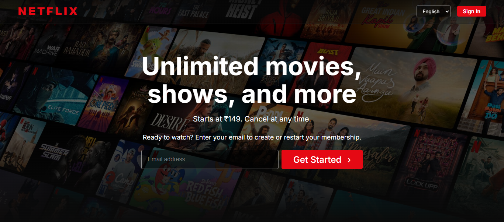
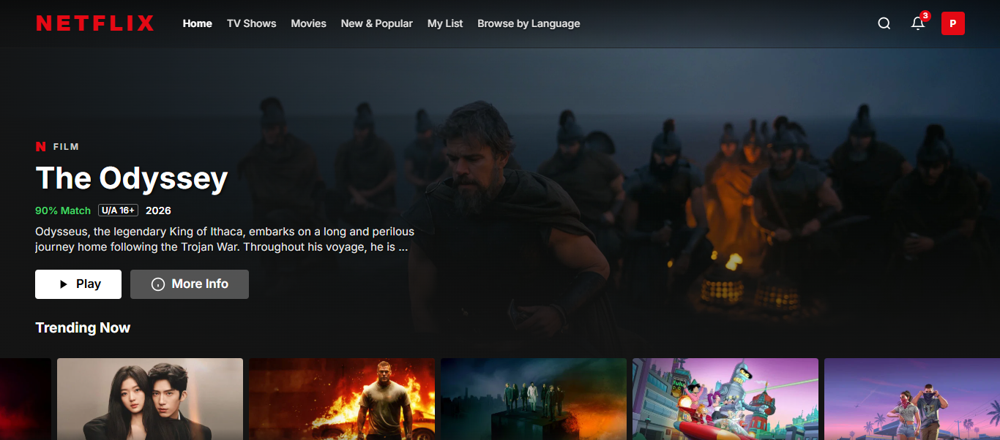
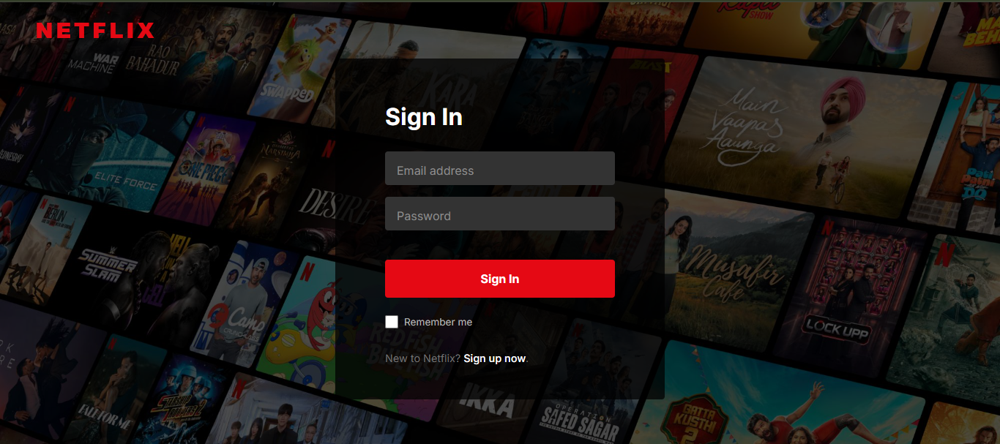
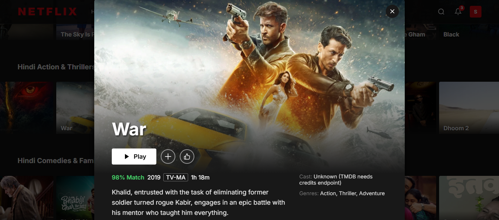

# 🎬 Netflix Clone

A full-stack **Netflix-inspired streaming platform** built with the **MERN stack**. Features a modern responsive UI, TMDB integration, authentication, hover previews, trailers, and cinematic movie details.

## 🚀 Live Demo

👉 [Go Live]((https://netflix-clone-e34395n94-satish-stuffs.vercel.app/))

## 📸 Screenshots

### Landing Page


### Browse Page


### Login Page


### Movie Details


## ✨ Features

- 🎥 Netflix-inspired responsive UI
- 🔐 JWT-based authentication
- 🔒 Protected routes
- 🔑 Password hashing with bcrypt
- 🎬 TMDB movie & TV show integration
- 🔥 Trending and category-based content
- ▶️ Trailer previews
- 🖱️ Netflix-style hover cards
- 🎞️ Cinematic movie detail modal
- 📱 Responsive design
- 🗄️ MongoDB integration

## 🛠️ Tech Stack

### Frontend
- React.js
- Vite
- React Router DOM
- Framer Motion
- Axios
- CSS

### Backend
- Node.js
- Express.js
- MongoDB
- Mongoose
- JWT
- bcryptjs
- CORS
- dotenv

### API
- TMDB API

## 📂 Project Structure

```text
Netflix-Clone/
│
├── public/
├── src/
│   ├── assets/
│   ├── components/
│   ├── context/
│   ├── pages/
│   └── services/
│
├── server/
│   ├── controllers/
│   ├── middleware/
│   ├── models/
│   ├── routes/
│   └── server.js
│
├── .env
├── package.json
├── vite.config.js
└── README.md
```

## ⚙️ Run Locally

### Clone Repository

```bash
git clone YOUR_GITHUB_REPOSITORY_URL
cd Netflix-Clone
```

### Install Frontend

```bash
npm install
```

### Install Backend

```bash
cd server
npm install
```

### Environment Variables

Create `.env` in the frontend root:

```env
VITE_TMDB_API_KEY=YOUR_TMDB_API_KEY
VITE_API_URL=http://localhost:5000
```

Create `.env` inside the `server` folder:

```env
PORT=5000
MONGO_URI=YOUR_MONGODB_URI
JWT_SECRET=YOUR_SECRET_KEY
TMDB_API_KEY=YOUR_TMDB_API_KEY
```

### Start Backend

```bash
cd server
npm start
```

### Start Frontend

```bash
npm run dev
```

Frontend: `http://localhost:5173`

Backend: `http://localhost:5000`

## 🔐 Authentication Flow

```text
Signup
   ↓
Password Hashing
   ↓
MongoDB
   ↓
JWT Token
   ↓
Protected Routes
```

```text
Login
   ↓
Verify Credentials
   ↓
Generate JWT
   ↓
Access Protected Content
```

## 🔮 Future Enhancements

- Profile management
- Continue Watching
- Browse by language
- Video player
- Admin dashboard
- Subscription

## 🎓 Purpose

Built this clone for **learning and academic purposes** to practice MERN stack development, REST APIs, authentication, React state management, responsive UI design, and third-party API integration.

---

⭐ If you like this project, consider giving the repository a star!
```
